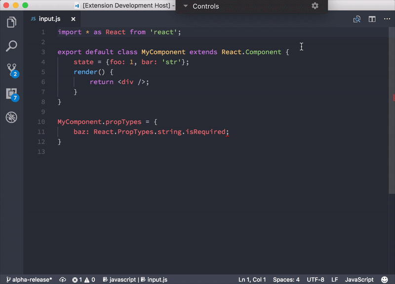

# React JavaScript to TypeScript Transformer for VSCode

**Convert your React code from JavaScript to TypeScript automatically.**

Source code for transform is at [lyft/react-javascript-to-typescript-transform](https://github.com/lyft/react-javascript-to-typescript-transform)

## Reporting bugs

Please report bugs to [transformer repo](https://github.com/lyft/react-javascript-to-typescript-transform/issues) even if you have an issue with the extension.

## Extension Contributions

* `extension.convertReactToTypeScript`: Convert a React file to TypeScript

## License
MIT
